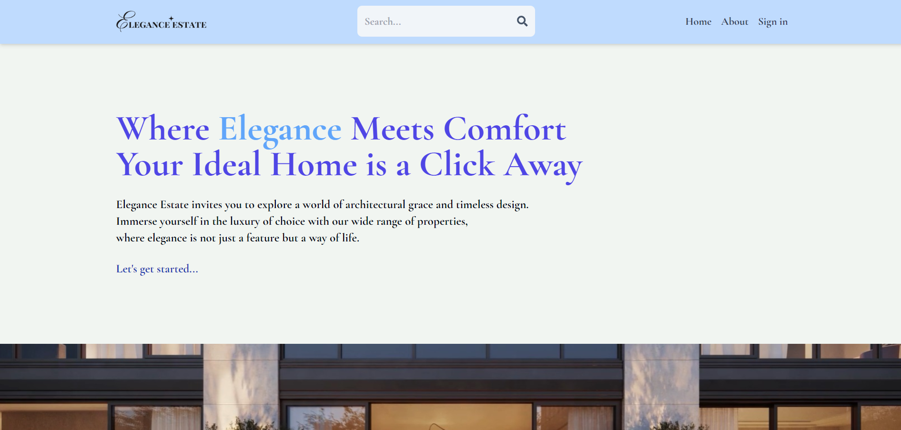

# Elegance Estate: MERN Stack Real Estate Application with React and Advanced Authentication

Elegance Estate is a full-stack real estate web application developed using the MERN stack, aimed at providing a seamless user experience for property listings management and discovery. With advanced authentication mechanisms, intuitive features, and enhanced search functionality, Elegance Estate ensures secure user access and efficient property exploration.

## Features

- **Secure Authentication**: 
  - Leveraging technologies such as JWT, Firebase, and Google OAuth, Elegance Estate guarantees secure user access, protecting sensitive information and ensuring peace of mind for both users and administrators.

- **CRUD Operations**: 
  - Implementing CRUD (Create, Read, Update, Delete) operations for property listings management, users can effortlessly add, edit, or remove listings according to their preferences.

- **Intuitive User Interface**: 
  - Elegance Estate boasts an intuitive and user-friendly interface, facilitating easy navigation and enhancing the overall user experience. Features such as image uploads streamline the process of listing properties, making it convenient for users to showcase their offerings effectively.

- **Enhanced Search Functionality**: 
  - The application integrates advanced search functionality, simplifying property discovery for users. With tailored search options, users can easily find properties that match their specific criteria, saving time and effort.

## Technologies Utilized

Elegance Estate harnesses a range of cutting-edge technologies to deliver its functionality and performance:

- **MERN Stack**: 
  - Utilizing MongoDB, Express.js, React.js, and Node.js, Elegance Estate offers a robust and scalable architecture for seamless development and deployment.

- **React.js**: 
  - Leveraging the power of React.js, the frontend of Elegance Estate delivers dynamic and responsive user interfaces, enhancing user engagement and interaction.

- **Redux Toolkit**: 
  - Incorporating Redux Toolkit for state management ensures efficient handling of application state, providing a smooth and consistent user experience across different components.

- **MongoDB**: 
  - Employing MongoDB as the database technology enables efficient storage and retrieval of property listings and user data, ensuring reliability and scalability.

- **Tailwind CSS**: 
  - Leveraging Tailwind CSS for styling, Elegance Estate achieves a sleek and modern design aesthetic, enhancing the visual appeal of the application.

## Deployment

Elegance Estate is deployed on the 'render' platform. Visit [Elegance Estate](https://elegance-estate.onrender.com) to explore the application.

---

With its advanced features, secure authentication mechanisms, and intuitive user interface, Elegance Estate redefines the real estate browsing experience, providing users with a seamless platform for discovering and managing properties.
